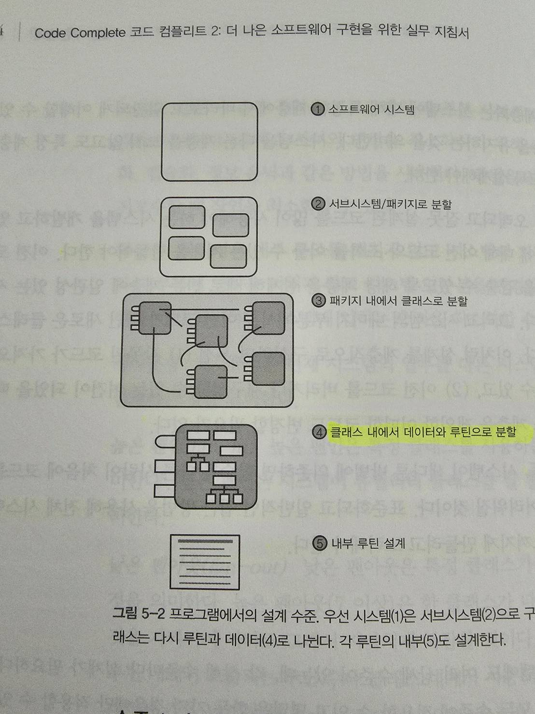

# 구현 설계
**설계**란 단순히 상세 부분을 작성하기 전에 **의사코드(pseude code)로 클래스 인터페이스를 작성**하는 것일 수도 있고, 코드로 구현하기 전에 몇몇 **클래스 사이의 관계를 다이어그램으로 그리는 것**일 수도 있고, 다른 개발자에게 **어떤 디자인 패턴이 더 좋은지 물어보는 것**일 수도 있다.

- [5.1 설계의 어려움](#51--------)
  * [1. 설계는 불명확한 문제다](#1-------------)
  * [2. 설계는 엉성한 프로세스다(결과는 정돈되었을지라도)](#2----------------------------)
  * [3. 설계는 절충과 우선순위의 문제다](#3------------------)
  * [4. 설계에는 제약이 따른다](#4-------------)
  * [5. 설계는 비결정적이다](#5-----------)
  * [6. 설계는 발견적 학습 과정이다](#6----------------)
  * [7. 설계는 창발적이다 (창발적 - 개개의 특성이 모여서 함께 작용할 때 전혀 다른 새로운 성질을 만들어낸다는 뜻)](#7--------------------------------------------------------------)
- [5.2 핵심 설계 개념](#52---------)
  * [1. 본질적 어려움과 비본질적 어려움](#1------------------)
  * [2. 복잡성 관리의 중요성](#2------------)
  * [3. 복잡성을 해결하는 방법](#3-------------)
  * [4. 바람직한 설계의 특징](#4------------)
  * [5. 설계 수준](#5------)
    + [가. 수준 1: 소프트웨어 시스템](#-----1-----------)
    + [나. 수준 2: 서브시스템이나 패키지로 분할](#-----2-----------------)
    + [다. 수준 3: 클래스로 분할](#-----3---------)
    + [라. 수준 4: 루틴으로 분할](#-----4---------)
    + [마. 수준 5: 내부 루틴 설계](#-----5----------)
- [5.3 설계 빌딩 블록: 발견적 학습](#53-----------------)
  * [1. 현실 세계의 객체를 찾아라](#1---------------)
    + [가. 객체와 객체의 속성을 식별한다.](#------------------)
    + [나. 각 객체에 무엇을 할 수 있는지 결정한다.](#------------------------)
    + [다. 각 객체가 다른 객체에 무엇을 할 수 있는지 결정한다.](#-------------------------------)
    + [라. 각 객체에서 다른 객체에 보일 부분을 결정한다.](#---------------------------)
    + [마. 각 객체의 인터페이스를 정의한다.](#-------------------)
  * [2. 일관성 있게 추상화하라](#2-------------)
  * [3. 구현 세부 사항을 캡슐화하라](#3----------------)
  * [4. 상속이 설계를 단순화할 수 있을 때 상속하라](#4-------------------------)
  * [5. 비밀을 숨겨라(정보 은닉)](#5---------------)
    + [가. 비밀과 프라이버시](#-----------)
    + [나. 은닉의 두 가지 부류](#-------------)
    + [다. 정보 은닉의 장애물](#------------)
    + [라. 정보 은닉의 가치](#-----------)
  * [6. 변경될 것 같은 영역을 찾아라](#6-----------------)
    + [가. 변경의 정도 예측하기](#-------------)
  * [7. 결합을 느슨하게 유지하라](#7--------------)
    + [가. 결합의 기준](#--------)
    + [나. 결합의 종류](#--------)
  * [8. 일반적으로 널리 사용되는 디자인 패턴을 찾아라](#8--------------------------)
  * [9. 다른 발견적 학습](#9----------)
  * [10. 설계의 발견적 학습에 대한 요약](#10------------------)
  * [11. 발견적 접근 방법을 위한 지침](#11-----------------)
- [5.4 설계 실천법](#54-------)
  * [1. 반복](#1---)
  * [2. 분할과 정복](#2-------)
  * [3. 하향식과 상향식 설계 접근 방법](#3------------------)
  * [4. 하향식 접근 방법을 지지하는 주장](#4-------------------)
  * [5. 상향식 접근 방법을 지지하는 주장](#5-------------------)
  * [6. 사실상 논쟁은 없다](#6-----------)
  * [7. 실험적인 프로토타이핑](#7------------)
  * [8. 협력적인 설계](#8--------)
  * [9. 설계를 얼마나 해야 할까?](#9---------------)
  * [10. 설계 작업 기록하기](#10-----------)
- [5.5 잘 알려진 방법론에 대한 의견](#55-----------------)
   

## 5.1 설계의 어려움
### 1. 설계는 불명확한 문제다
- 문제를 명확하게 정의하려면 **문제를 한 번 해결**해야 하며, 작동하는 솔루션을 만들기 위해서 **다시 문제를 해결**해야 한다는 의미를 담고 있다.

### 2. 설계는 엉성한 프로세스다(결과는 정돈되었을지라도)
- **실수를 하는 것**이 설계의 핵심이다.
- 설계 단계에서 실수하고 고치는 것이 똑같은 실수를 코드 작성 후에 발견하여 코드를 수정하는 것보다 비용이 적게 든다.
- 설계는 얼마나 구체적이어야 할까? 
    - 설계는 완성되는 시점이 분명하지 않으므로 이 질문의 가장 흔한 대답은 **더 이상 시간이 없을 때**까지다.

### 3. 설계는 절충과 우선순위의 문제다
- 현실 세계에서는 설계자의 주요 업무 중 하나가 서로 상충하는 설계 특징을 비교하여 그 특성들 사이의 균형을 맞추는 일이다.
    - 개발 시간 vs 빠른 응답 속도 중 **중요한 것이 무엇인지에 따라 설계자는 그에 맞는 설계를 선택**할 것이다.

### 4. 설계에는 제약이 따른다
- 설계의 핵심은 어느 정도는 **가능성을 만들고** 어느 정도는 **가능성을 제한**한다는 데 있다.

### 5. 설계는 비결정적이다
- 어떤 목적을 달성하는 방법은 한 가지 이상일 수 있지만 **컴퓨터 프로그램을 설계하는 방법은 보통 수십 가지**에 이른다.

### 6. 설계는 발견적 학습 과정이다
- 설계에는 **시행착오**가 따른다. 어떤 작업에서 효과가 있던 설계 툴이나 기법이 다음 프로젝트에서는 효과가 없을 수도 있다.

### 7. 설계는 창발적이다 (창발적 - 개개의 특성이 모여서 함께 작용할 때 전혀 다른 새로운 성질을 만들어낸다는 뜻)
- 설계는 누군가의 머릿속에서 완전한 형태로 갑자기 솟아 나오지 않는다. 설계는 **설계 검토**와 **격식 없는 토론**, **코드 작성 경험 자체**, **코드 수정 경험**을 통해 진화하고 발전한다.

## 5.2 핵심 설계 개념

> 소프트웨어의 주요 기술적 의무: 복잡성 관리
### 1. 본질적 어려움과 비본질적 어려움
- 소프트웨어 개발의 본질적인 어려움은 **복잡하고 무질서한 현실 세계와 상호작용**하고, **종속 관계와 예외 상황들을 정확하고 완벽하게 규명**하며, 대충이 아니라 **정확히 맞는 솔루션을 설계**해야 하기 때문에 발생한다.

### 2. 복잡성 관리의 중요성
- 소프트웨어는 무슨 일이 일어나는지 **아무도 모를 정도로 복잡성이 증가할 수 있다.**
- 프로젝트에서 한 영역의 코드를 변경했을 때 **다른 부분에 어떤 영향을 미치는지 완벽하게 이해하는 사람이 없을 정도**라면 더 이상 개발을 할 수 없는 지경에 이른 것이다.
- 따라서 한 번에 **한 부분을 제대로 집중할 수 있게** 프로그램을 구성하도록 노력해야 한다.
- 소프트웨어 아키텍처 수준에서는 시스템을 **서브시스템으로 나누어 문제의 복잡성을 줄인다.**
- 모든 소프트웨어 설계 기법의 목표는 **복잡한 문제를 간단한 문제로 나누는 것**이다.
- **서브시스템이 독립적일수록** 한 번에 복잡한 부분의 일부에 집중하기가 더 쉽다.
- **루틴을 짧게 유지**하면 신경 쓸 부분이 줄어든다.
- 결론적으로 **인간의 선천적인 한계를 보완할 줄 아는 개발자** :smile: 는 자신뿐만 아니라 다른 사람도 이해하기 쉽고 오류가 적은 코드를 작성한다.

### 3. 복잡성을 해결하는 방법
- 비효과적인 설계는 다음과 같은 상황에서 발생한다.
    - **간단한 문제를 복잡하게** 해결할 때
    - **복잡한 문제를 단순하고 잘못된 방법**으로 해결할 때
    - **복잡한 문제를 부적절하고 복잡하게** 해결할 때
- 복잡성을 관리하는 두 가지 접근 방법이다.
    - 두뇌가 한 번에 처리해야 하는 **본질적인 복잡성의 양을 최소화**한다.
    - **비본질적인 복잡성이 불필요하게 증가하지 않도록** 한다.
- 다른 기술적인 목표를 달성하는 것보다 **복잡성을 관리하는 것이 중요하다는 점**을 이해하고 있다면 설계 시 무엇을 고려할지 분명해진다.

### 4. 바람직한 설계의 특징
- 복잡성 최소화
    - 특정한 부분을 살펴보고 있을 때 **다른 부분에 대해서도 함께 살펴봐야 한다면 잘못된 설계**라고 말할 수 있다.
- 유지보수의 편리함
    - 유지보수 개발자를 청중이라고 생각하고 **시스템을 쉽게 이해할 수 있도록** 설계한다.
- 느슨한 결합
    - 클래스 인터페이스에서의 **추상화, 캡슐화, 정보 은닉**과 같은 방법을 사용한다.
    - **연결을 최소화**하면 통합이나 테스트, 유지보수할 때 **작업을 최소화**할 수 있다.
- 확장성
    - 다른 부분에 **영향을 미치지 않고 시스템 일부분을 변경할 수 있도록** 설계한다.
- 재사용성
    - 현재 시스템의 일부를 **다른 시스템에 사용할 수 있도록** 시스템을 설계한다.
- 높은 팬인(fan-in)
    - 시스템이 **유틸리티 클래스를 잘 활용하도록** 설계한다.
- 낮은 팬아웃(fan-out)
    - 특정 클래스가 **다른 클래스를 적게 사용하도록** 설계한다.
- 이식성
    - 시스템을 **다른 환경으로 쉽게 이동시킬 수 있도록** 설계한다.
- 간결성
    - **불필요한 부분이 없게** 시스템을 설계한다.
    - 기능을 추가하기는 쉬운데 어떤 문제가 발생하게 될까?에 대해서 답할 수 있어야 한다.
- 계층화
    - 시스템에 대해 **특정한 계층에서 바라보고 일관되게 이해할 수 있도록** 분산 계층을 유지한다.
    - 시스템을 **다른 계층을 보지 않고도 특정 계층에서 볼 수 있도록** 설계한다.
- 표준 기법들
    - **표준화되고 일반적인 접근 방법을 사용**해 전체 시스템이 친숙하다고 느껴지게 만들려고 노력한다.

### 5. 설계 수준

#### 가. 수준 1: 소프트웨어 시스템
- **전체 시스템**이다.

#### 나. 수준 2: 서브시스템이나 패키지로 분할
- 프로그램을 주요 서브시스템으로 어떻게 나눌 것인지, 각 서브시스템이 다른 서브시스템을 어떻게 사용하게 할 것인지를 결정한다.
- 서로 다른 서브시스템이 서로 어떻게 소통할 것인지에 대한 규칙을 정하는 것이 중요하다.
- 서브시스템간의 커뮤니케이션은 "서로 알 필요"가 있을 때만 가능하게 만든다.
- **가장 간단한 관계는 하나의 서브시스템이 다른 서브시스템에 있는 루틴을 호출**하는 것이다.
- **가장 복잡한 관계는 한 서브시스템에 있는 클래스가 다른 서브시스템에 있는 클래스를 상속**받는 경우다.
- 공통적인 서브시스템
    - 비즈니스 규칙
    - 사용자 인터페이스
    - 데이터베이스 접근
    - 시스템 의존성

#### 다. 수준 3: 클래스로 분할
- 클래스의 인터페이스가 정의된다.
- 이 단계에서 가장 중요한 작업은 **개별적인 클래스로 구현할 수 있을 만큼 자세한 수준으로 모든 서브시스템을 확실하게 분해**하는 것이다.
- 프로젝트가 작다면 수준 1의 전체 시스템에 대한 부분만 명시하고 곧바로 수준 3으로 넘어갈 수도 있다.

#### 라. 수준 4: 루틴으로 분할
- 클래스의 **비공개(private) 루틴을 상세하게 설계**한다.
- 이 수준의 분할과 설계는 종종 개별 개발자가 수행하는 몇 시간 정도 걸리는 프로젝트에 서도 필요한 작업이다.

#### 마. 수준 5: 내부 루틴 설계
- 각 **루틴의 상세한 기능을 구현**한다.
- 설계는 의사코드를 작성하고 참고 서적에서 **알고리즘을 살펴보고** 루틴 내의 코드 단락을 어떻게 구성할 것인지를 결정하고 **프로그래밍 언어로 코드를 작성**하는 활동으로 구성된다.

## 5.3 설계 빌딩 블록: 발견적 학습
> 설계에는 정답이 없으므로 좋은 소프트웨어 설계를 위해서 발견적 학습을 효과적으로 적용해야 한다.

9가지의 설계방법을 알아보자.

### 1. 현실 세계의 객체를 찾아라
- 가장 널리 알려진 접근 방법은 **"정석대로의" 객체지향적 접근 방법**으로, 현실 세계의 객체와 가상의 객체를 찾는 것에 초점을 맞춘다.

#### 가. 객체와 객체의 속성을 식별한다.
- 컴퓨터 프로그램은 대개 **현실 세계의 엔티티에 기반**을 둔다.

#### 나. 각 객체에 무엇을 할 수 있는지 결정한다.

#### 다. 각 객체가 다른 객체에 무엇을 할 수 있는지 결정한다.
- 통상 객체가 서로에게 할 수 있는 두 가지 사항은 **포함과 상속**이다.

#### 라. 각 객체에서 다른 객체에 보일 부분을 결정한다.
- **어느 부분을 공개**하고 **어느 부분을 비공개**로 유지해야 하는지를 파악하는 것은 가장 중요한 결정 중 하나다.

#### 마. 각 객체의 인터페이스를 정의한다.
- 다른 모든 객체에 노출하는 데이터와 메서드를 객체의 **공개(public) 인터페이스**라고 한다.
- 더 나은 클래스 구성을 얻기 위해서 최상위 수준의 시스템 구성을 반복하여 진행할 테고, 지금까지 정의한 각 클래스를 더 상세하게 설계하는 작업을 반복할 것이다.

### 2. 일관성 있게 추상화하라
- 좋은 클래스 인터페이스는 클래스의 **내부 작업에 신경 쓰지 않고 인터페이스에 집중할 수 있게 해주는 추상화**다.
- 추상화의 가장 큰 장점은 **관련 없는 세부 사항을 무시할 수 있다는 것**이다.
- **현실 객체는 이미 어느 정도 추상화**되어 있다.
- "집"이라고 부른다면 추상화를 한 것이다. 집이 모여있는 집합을 "마을"이라고 한다면 그 또한 추상화한 것이다.
    - 집을 유리, 나무, 못의 결합이라고 하지는 않는다.
- 루틴 인터페이스 수준, 클래스 인터페이스 수준, 패키지 인터페이스 수준, 달리 말하면 손잡이 수준, 문 수준, 집 수준의 단계적인 추상화를 제공함으로써 더 빠르고 안전하게 프로그래밍할 수 있게 해준다.

### 3. 구현 세부 사항을 캡슐화하라
- **추상화는 객체를 높은 수준에서 볼 수 있도록** 하고 **캡슐화는 다른 수준에서 해당 객체를 특정 수준 이상으로 볼 수 없도록** 하는 것이다.
- 문이 나무로 만들어졌는지, 유리섬유나 강철, 또른 다른 재료로 만들어졌는지는 알 수 없고 목질 섬유 하나하나를 살펴보는 것은 당연히 허용되지 않는다.
- 캡슐화는 복잡한 부분을 보지 못하게 함으로써 복잡성을 관리하는 데 도움을 준다.

### 4. 상속이 설계를 단순화할 수 있을 때 상속하라
- 객체사이의 **유사성과 차이점을 정의하는 것을 상속**이라고 한다.
- 상속은 프로그래밍을 단순화한다.
- 상속은 객체지향 프로그래밍에서 가장 강력한 도구의 하나다.

### 5. 비밀을 숨겨라(정보 은닉)
- 설계나 구현에서 **나머지 프로그램으로부터 한 부분을 숨기기로 결정하는 것**이다.
- **정보 은닉은 구조적 설계와 객체지향 설계 모두에 있어 기본적인 부분**이다.
- 객체지향적인 설계에서는 **정보은닉을 위해 캡슐화와 모듈성 개념이 생겼고 추상화 개념과 연결**된다.
- 정보 은닉이 **재작업을 없애는 강력한 기법**이라고 밝혔으며 점증적이고 **변화가 많은 환경에서 특히 효과적**이라고 지적했다.
- 정보 은닉은 복잡성을 감추는 데 중점을 두고 있기 때문에 소프트웨어의 주요 **기술적 의무(복잡성 관리)에 특히 강력한 발견적 기법**이다.

#### 가. 비밀과 프라이버시
- 클래스 설계에서 가장 중요한 작업 중 하나는 **어떤 기능을 클래스 외부로 알리고 어떤 기능을 비밀로 남길지 결정하는 것**이다.
- 클래스 설계의 이러한 측면을 **가시성**이라고도 한다. 클래스의 어떤 기능이 클래스 외부에 **보이는지** 또는 **노출되는지**와 관련이 있기 때문이다.

#### 나. 은닉의 두 가지 부류
- 특별하게 **관심이 없는 경우에 고민할 필요가 없도록 복잡성을 감추는 것**
- 변경이 발생했을 때 그 효과가 일부에만 영향을 미치도록 변경의 원인을 감추는 것

#### 다. 정보 은닉의 장애물
- 정보의 지나친 배분
    - 시스템 전체에 정보를 지나치게 배분하는 것이다.
        - **상수에 값을 숨겨서 한 곳에서만 값이 바뀌도록 하는 것**이 좋다.
    - 시스템 전체에 사용자와 상호작용하는 기능을 끼워넣는 것
        - **단일 클래스나 패키지, 서브시스템에 모아 전체 시스템에 영향을 미치지 않고 변경하게 하는 것**이 좋다.
    - 전역 데이터 값
        - 프로그램이 **전역 데이터에 접근 루틴을 통해서만 데이터를 사용하도록** 해야 한다.
- 순환 의존성 (**순환 참조**)
    - 다른 쪽의 일부가 준비될 때까지 클래스 A나 클래스 B 둘 다 테스트할 수 없기 때문에 시스템을 테스트하기 어렵게 만든다.
- 성능 손해
    - 아키텍처 수준과 코드 작성 수준에서 성능 손해를 피하기 위한 시도
        - **데이터 항목에 간접적으로 접근하면 객체 생성과 루틴 호출이라는 추가적인 수준 때문에 실행 시 성능 손해가 발생할 것이라는 걱정**이다.

#### 라. 정보 은닉의 가치
- **이 클래스에서 무엇을 숨겨하 하는가**라고 묻는 것이 인터페이스 설계 문제를 해결하는 데 가장 중요하다.

### 6. 변경될 것 같은 영역을 찾아라
- 찾기 -> 분류 -> 고립
    - 변경된 클래스를 사용하는 클래스는 변경이 발생했다는 사실을 몰라야 한다.
    - 클래스의 인터페이스가 자신의 비밀을 보호해야 한다.
- 변경될 가능성이 큰 영역
    - 비즈니스 규칙
    - 하드웨어 의존성
    - 입력과 출력
    - 표준을 따르지 않는 언어 기능
    - 어려운 설계 및 구현 부분
    - 상태 변수

#### 가. 변경의 정도 예측하기
- 변경될 것 같은 영역을 식별하는 좋은 기법은 우선 프로그램에서 **사용자에게 쓸모가 있는 최소한의 부분을 파악하는 것**이다.
    - 그 부분이 시스템의 핵심을 이루고 변경될 가능성이 작다.
- 절대로 변경되지 않을 것 같은 부분만 시스템에서 하나 이상의 클래스에 큰 영향을 미치도록 허용해야 한다.

### 7. 결합을 느슨하게 유지하라
- 목표는 **다른 클래스나 루틴과 작고 직접적이며 눈에 띄고 유연한 관계를 갖는 클래스와 루틴을 생성하는 것**으로, 이를 "느슨한 결합(loose coupling)"이라고 한다.
    - 하나의 모듈이 다른 모듈에 의해 쉽게 사용될 수 있을 정도로 느슨한 상태가 훌륭한 결합이다.
- 모듈 사이의 연결은 될 수 있는 한 단순해야 한다.
    - **다른 모듈에 거의 의존하지 않는 모듈**을 생성하려고 노력하라.
    - **다른 모듈에 내부에서 무슨일이 벌어지는지 알아야 하는 방식은 강하게 결합**되어 있는 것이다.
- 두 클래스가 **동일한 전역 데이터를 사용하는 경우에는 서로 훨씬 더 긴밀하게 결합**된다.

#### 가. 결합의 기준
- 크기
    - **모듈 사이의 연결 횟수**를 의미한다.
    - **매개변수를 하나만 받는 루틴이 여섯 개의 매개변수를 받는 루틴보다 그것을 호출하는 모듈에 느슨하게 결합**되어 있다.
    - **잘 정의된 네 개의 공개 메서드를 갖는 클래스**는 **37개의 공개 메서드를 노출한 클래스보다 그 클래스를 사용하는 모듈에 느슨하게 결합**되어 있다.
- 가시성
    - **두 모듈 간의 연결이 얼마나 명시적인지**를 의미한다.
    - 가능한 한 **연결 부분을 눈에 띄게** 만들어야 더 많은 명성을 얻을 수 있다.
    - **매개변수 목록에 데이터를 전달하는 것은 분명하게 연결하는 것**이기 때문에 좋다.
    - 다른 모듈이 데이터를 사용할 수 있도록 **전역 데이터를 수정하는 것은 교묘한 연결**이기 떄문에 나쁘다.
- 유연성
    - **얼마나 쉽게 모듈 사이의 연결을 변경할 수 있는지**를 의미한다.
    - **다른 모듈이 내부에서 무엇을 해야하는지(하는지) 알아야 하는 인터페이스**는 유연성이 떨어진다.
        - 특정 필드만 사용하는 루틴에 해당 필드만 채워진 객체를 넘기는 형태보다는 명확한 필드 데이터를 별도의 독립된 데이터로 전달하는 것이 더 유연하다.

#### 나. 결합의 종류
- 간단한 데이터 매개변수 결합
    - **모든 데이터가 기본 데이터형이고 모든 데이터가 매개변수로 전달된다면 두 모듈은 단순-데이터-매개변수로 결합**된 것이다.
- 간단한 객체 결합
    - **모듈이 객체를 인스턴스화 한다면 그 모듈은 객체에 단순-객체로 결합**된 것이다.
        - @pistis : 무슨 뜻인지 명확히 이해가 안됨
- 객체 매개변수 결합
    - Object1이 Object2에게 Object3를 넘겨달라고 요구한다면 두 모듈은 서로에 대해서 객체-매개변수로 결합한 것이다.
    - **Object2가 Object3에 대해서 알아야 하기 때문에 데이터 매개변수 결합보다 강한 결합**이다.
- **의미론적인 결합**
    - 다른 모듈의 내부 작동에 대한 논리적인 지식을 사용할 때 가장 발견하기 어려운 종류의 결합이 발생한다.
        - **Module1이 Module2에게 무엇을 할지 지시하기 위해서 Module2에 제어 플래그를 전달**한다.
            - **제어 플래그에 대해 특정 데이터형을 정의한다면(열거형이나 객체) 이러한 방법을 사용해도 문제가 없을 것이다**.
                - @pistis : 이거 생각보다 많이 쓰이는 방식
        - Module1이 전역 데이터를 수정한 후에 Module2가 전역 데이터를 사용한다.
            - 원하는 방법대로 전역 데이터를 수정했고 **적절한 시간에 호출되었다는 가정이 필요**하다.
        - Module1이 Object를 Module2에 전달한다. **Module1은 Module2가 Object의 7개 메서드 중에서 세 개만 사용한다는 것을 알고 있기 때문에 필요한 데이터만 부분적으로 초기화**한다.
        - Module1이 전달한 Object를 **Module2가 특정한 객체로 변환하여 해당 객체의 메서드를 호출**한다.
    - **사용된 모듈의 코드를 변경하면 모듈을 사용하는 코드가 컴파일러로 절대 감지할 수 없게 망가질 수 있기 때문에** 의미론적 결합은 위험하다.
    - **모듈이 추가적인 추상화 수준을 제공하는 것이 느슨한 결합의 핵심**이다.

### 8. 일반적으로 널리 사용되는 디자인 패턴을 찾아라
- 대부분 문제는 과거의 문제와 유사하고, 비슷한 해결책이나 패턴을 사용해 해결할 수 있다.
- 일반적으로 널리 사용되는 패턴에는 **어댑터(Adapter)**, **브리지(Bridge)**, **데코레이터(Decorator)**, **파사드(facade)**, **팩토리 메서드(Factory Method)**, **옵저버(Observer)**, **싱글턴(Singleton)**, **스트래티지(Strategy)**, **템플릿 메서드(Template Method)**가 있다.
- 패턴은 **이미 만들어진 추상화를 제공**함으로써 복잡성을 줄인다.
- 패턴은 **일반적으로 널리 사용되는 해결책의 세부 사항들을 규정**함으로써 오류를 줄인다.
- 패턴은 **대안을 제안함으로써 발견적 학습의 가치를 제공**한다.
- 패턴은 **설계에 대해 수준 높은 논의를 할 수 있게 해서 의사소통을 원활**하게 한다.
- 패턴은 숙련된 개발자 **대부분이 알고 있는 내용에 능률적이고 효과적인 대화가 가능하도록 이름을 붙인 것**뿐이다.
- 디자인 패턴은 **복잡성을 관리하기 위한 강력한 도구**다.

### 9. 다른 발견적 학습
- 응집력을 강하게 하라
    - 클래스에 있는 모든 루틴이나 루틴에 있는 모든 코드가 얼마나 밀접하게 중심 목적을 지원하고 있는지, 그 클래스가 얼마나 집중되어 있는지를 나타낸다.
    - **중심 목표를 더 많이 지원할수록 코드가 수행하는 모든 것을 더 쉽게 기억**할 수 있기 때문이다.
- 계층을 만들어라
    - 가장 일반적이거나 추상적인 항목이 최상위에 위치하고 점차 상세하고 구체적인 항목이 낮은 수준에 위치한다.
    - 사람들은 복잡한 정보를 체계화하기 위해 계층 구조를 파악한다.
        - 집과 같은 복잡한 물체를 그릴 때 계층적으로 그린다.
    - **현재 다루고 있는 수준에만 집중**할 수 있기 때문이다.
    - 세부 사항이 완전히 사라지는 것이 아니라 **모든 것을 동시에 생각하는 대신 원할 때만 생각할 수 있도록 세부 사항을 다른 수준으로 옮기는 것**뿐이다.
- 클래스 계약을 형식화하라
    - 각 클래스의 인터페이스를 나머지 프로그램과의 계약으로 생각하는 것이 이해하는 데 도움이 된다.
    - 계약은 적어도 **이론상으로는 객체가 계약에 없는 행위를 무시해도 되기 때문에 복잡성을 괸리하는 데 유용**하다.
- 책임을 할당하라
    - 객체가 무엇을 책임져야 하는지 묻는 것은 어떤 정보를 감추어야 하는지 묻는 것과 유사하지만, 개인적으로는 **책임을 묻는 것이 더 광범위한 답을 제공해 특별한 발견적 가치를 부여한다고 생각**한다.
- 테스트가 가능하도록 설계하라
    - 테스트가 가능하도록 설계하면 **더 규격화된 클래스 인터페이스가 만들어지는 경향**이 있으며 이는 일반적으로 도움이 된다.
- 실패를 피하라
    - 단순히 다른 성공적인 설계의 특성을 따르기보다는 **크리티컬한 이슈가 발생할 수 있는 경우를 주의 깊게 고려**하여 실패를 피하라
- 결합 시점을 의식적으로 선택하라
    - 특정 값이 변수에 결합하는 시점을 말한다.
    - 이 변수를 초기에 결합한다면 어떻게 될까? 이 값들을 나중에 결합한다면 어떻게 될까? 이 테이블을 코드에서 초기화하거나 실행 시 사용자로부터 변수의 값을 읽는다면 어떻게 될까?
- 제어 지점을 정하라
    - 제어는 클래스와 루틴, 전처리기 매크로, #include 파일에 집중될 수 있고, 이름 상수도 제어 지점의 예가 될 수 있다.
        - 복잡성이 줄어들면 찾아야 하는 장소가 줄고 더 쉽고 안전하게 변경할 수 있다는 이점을 얻는다.
- 주먹구구식 기법의 사용을 고려하라
    - 가장 강력한 발견적 학습 도구 중 하나는 **주먹구구식 기법(단순 무식한 방법)이다. 이 방법을 과소평가하지 말라**.
    - 이진 검색이 더 우아한 방법이지만, 주먹구구식의 순차 검색만으로도 충분할 때가 많다.
- 다이어그램을 그려라
    - **천 마디 말보다 그림 한 장**이 낫다. 
    - 그림을 사용하면 더욱 높은 추상화 수준에서 문제를 표현할 수 있기 때문에 천 마디 말을 사용하지 않아도 된다.
- 모듈화를 유지하라
    - 모듈화의 목표는 **각 루틴이나 클래스를 "블랙박스" 처럼 만드는 것**이다.
    - 무엇이 들어가고 나오는지 알지만, **안에서 무슨 일이 일어나는지는 알지 못한다**.
    - 블랙박스는 **단순한 인터페이스와 잘 정의된 가능성 덕분에 어떤 입력이 들어와도 그에 따른 출력을 정확하게 예상**할 수 있다.
    - 모듈화 개념은 **정보 은닉과 캡슐화, 다른 설계에서의 발견적 학습 방법과 관련이 있다**.

### 10. 설계의 발견적 학습에 대한 요약
- 현실 세계의 객체를 찾아라
- 일관성 있는 추상화를 구성하라
- 세부 사항을 캡슐화하라
- 가능할 때 상속하라
- 비밀을 숨겨라(정보 은닉)
- 변경될 것 같은 영역을 규명하라
- 느슨한 결합을 유지하라
- 일반적으로 널리 사용되는 디자인 패턴을 찾아라

### 11. 발견적 접근 방법을 위한 지침
- 가장 효과적인 지침 중 하나는 **한 가지 접근 방법에 매달리지 않아야 한다는 것**이다.
- 설계를 **UML로 표현할 수 없다면 영어나 그 밖의 자연어로 작성**한다.
- **간단한 테스트 프로그램을 작성**한다.
- **완전히 다른 접근 방법을 시도**해 본다.
- **주먹구구식의 해결책**을 생각해 본다.
- 계속 **팬으로 개요와 밑그림을 그리면** 자연스럽게 이해할 수 있을 것이다.
- 최선을 다했는데도 방법을 찾을 수 없을 때는 **잠시 문제에서 손을 놓는 것**이 끝까지 잡고 늘어지는 것보다 더 빨리 해결되는 경우가 종종 있다.
- 설계 문제 **전체를 한 번에 해결할 필요는 없다.**

## 5.4 설계 실천법
### 1. 반복
- 설계는 **반복적인 프로세스**다.
- 상위 수준 문제를 다루면서 얻는 **큰 그림은 거시적 관점에서 하위 수준의 세부 사항을 기재하는 데 도움될 것**이다.
- 하위 수준 문제를 다루면서 얻게 되는 **세부 사항은 더 현실적인 상위 수준 설계를 가능**하게 한다.
- 최상위 수준과 최하위 수준의 고려 사항을 조율하여 안정적인 강화 구조를 만들어야 한다.
- 처음으로 작성한 설계가 충분히 좋아 보여도 멈추지 말라! 두 번째 시도는 첫 번째보다 거의 항상 더 좋고, **설계를 되풀이할 때마다 전체 설계를 향상시킬 수 있다는 것을 배우게 된다.**

### 2. 분할과 정복
- 프로그램을 **서로 다른 관심 영역으로 나누고 각 부분을 개별적으로 처리**하도록 한다.
- **점증적인 개선은 복잡성을 다루는 강력한 도구**다
- **문제를 이해**하고 **계획을 수립하여 수행**하고 **어떻게 했는지를 검토**하도록 한다.

### 3. 하향식과 상향식 설계 접근 방법
- **하향식 설계는 높은 추상화 수준에서 시작**한다.
    - 기본 클래스나 구체적이지 않은 다른 설계 요소를 정의한다.
    - 설계를 하면서 파생 클래스 규명하기와 클래스 공동 작업, 다른 세부적인 설계 요소 등 상세화 수준을 높인다.
- **상향식 설계는 구체적인 것에서 시작해 일반적인 쪽으로 작업**한다.
    - 전형적으로 구체적인 객체를 규명하는 것부터 시작하고 그 내용으로부터 객체와 기본 클래스 집합을 일반화한다.

### 4. 하향식 접근 방법을 지지하는 주장
- 기본 원칙은 **인간의 두뇌가 한 번에 집중할 수 있는 양에 한계가 있다는 개념**이다.
- 일반적인 클래스부터 시작해 단계별로 클래스를 더 구체적인 클래스로 분해한다면 **두뇌가 한 번에 너무 많은 세부 사항을 처리하지 않아도 될 것**이다.
- 분할-정복 프로세스는 두 가지 면에서 반복적이다.
    - 일반적으로 한 수준만 분해하고 작업을 중단하지 않기 때문에 반복적이다. 계속해서 여러 수준으로 진행한다.
    - 일반적으로 첫 번째 시도에 만족하지 않기 떄문에 반복적이다.
- 프로그램을 어디까지 분해할 것인가? 분해보다 코드 작성이 더 쉬워 보일 때까지 계속 분해한다.
- 설계가 너무 분명하고 쉬워 보여 안절부절못할 정도가 될 때까지 작업한다.
- 그런 시점이 되면 작업이 완료된 것이다.

### 5. 상향식 접근 방법을 지지하는 주장
- **하향식 접근 방법은 너무 추상적이어서 시작하기가 어렵다.**
- 더 가시적으로 작업해야 한다면 상향식 설계 접근 방법을 시도하라
- "이 시스템이 무엇을 해야 하는지에 대해서 얼마나 알고 있지?" 라고 스스로 질문해 본다.
- 구체적인 클래스에 할당할 수 있는 저수준 책임을 식별할 수도 있다.
- 여러 가지 **하위 수준의 책임을 식별한 후에는 일반적으로 상위 수준을 편하게 볼 수 있게 된다.**
- 때에 따라서는 **설계 문제의 주요한 특성이 하위 수준에서 결정되기도 한다.**
- **하드웨어의 인터페이스 요구사항이 설계의 큰 부분을 차지할 때는 그 하드웨어 장치와 접속해야 할 수도 있다.**
- 상향식 구성시 기억해야 할 사항들
    - 시스템이 무엇을 해야 하는지 알고 있는지 스스로 묻는다
    - 그 질문으로부터 구체적인 객체와 책임을 파악한다
    - 공통적인 객체를 식별하고, 서브시스템 구조나 패키지, 객체 내에서의 합성, 상속 등 적합한 것을 사용해 그 객체들을 그룹 짓는다
    - 다음 상위 수준에서 작업을 계속하거나 최상위로 돌아가 다시 하위 수준으로 작업을 진행한다.

### 6. 사실상 논쟁은 없다
- 하향식과 상향식 전략의 가장 중요한 차이는 **전자는 분해 전략**이고 **후자는 결합 전략**이라는 것이다.
- 전자는 일반적인 문제에서 시작해 괸리할 수 있는 조각으로 나누고, 후자는 관리할 수 있는 부분에서 시작해 일반적인 솔루션을 구축한다.
- **두 접근 방법 모두 설계 문제에 적용할 때 고려해야 하는 장단점이 있다.**
- **하향식 설계의 장점은 쉽다는 것**이다. 사람들은 큰 것을 작은 요소로 분해하는 것에 능숙하며, 개발자들은 특히 그렇다.
- 하향식 설계의 **또 다른 장점은 세부 사항 구현을 미룰 수 있다는 것**이다.
- 상향식 접근 방법의 **한 가지 장점은 일반적으로 필요한 유틸리티 기능을 초기에 파악할 수 있어서 간결하고 잘 구성된 설계가 만들어진다는 것**이다.
- 유사한 시스템이 이미 개발되어 있을 때 상향식 접근 방법을 사용하면 이전 시스템을 살펴보고 무엇을 재사용할 수 있는지 살펴본 후 새로운 시스템의 설계를 시작할 수 있다.
- 상향식 결합 접근 방법의 **약점은 이 접근 방법만 사용해서 개발하기는 쉽지 않다는 것**이다.
- 대부분의 사람은 작은 개념으로 큰 개념을 만드는 것보다는 큰 개념을 가져다가 작은 개념으로 나누는 것을 더 잘한다.
- 상향식 설계 전략의 또 다른 약점은 **이미 시작한 조각으로 프로그램을 만들 수 없다는 사실을 알게 되는 경우가 있다는 것**이다.
- **최상위 수준에서 작업해야만 하위 수준에서 어떤 조각이 필요한지 알게 될 수도 있다.**
- 결론적으로 말하면 **하향식 설계와 상향식 설계는 배타적인 전략이 아니고 상호 보완적이다.**
- **설계는 발견적 학습 과정**이고, **이 말은 곧 매번 옳은 솔루션은 없다는 뜻**이다.
- **설계는 시행착오를 포함**한다.

### 7. 실험적인 프로토타이핑
- 때로는 구현 세부 사항을 제대로 이해하기 전에는 설계가 적합한지 실제로 알 수 없는 경우가 있다.
- 즉, **최소한 부분적으로라도 문제를 해결하기 전까지는 설계 문제를 완전하게 정의할 수 없다.**
- **적은 비용으로 이러한 문제를 해결하는 일반적인 기법이 실험적인 프로토타이핑이다.**
- 이 상황에서 프로토타이핑은 특정한 설계 질문에 답하는 데 필요한 최소한의 임시(쓰고 버리는) 코드를 작성하는 것을 의미한다.
- 프로토타이핑에 사용한 코드를 **쓰고 버리는 코드로 취급하지 않았을때에는 효과를 발휘하지 않는다.**
- 프로토타이핑을 위해서 작성한 코드가 언젠가는 제품 시스템에 들어갈 것으로 생각하는 개발자라면 질문에 답하기 위해서 최소한의 코드를 작성하는 것이 불가능하다고 생각한다.
- 질문에 대한 답을 얻는 즉시 코드를 버릴 것이라는 태도를 취함으로써 이러한 위험을 최소화할 수 있다.
- 제대로 사용하면 프로토타이핑은 설계의 사악함과 싸워야 하는 설계자에게 유용한 도구다. 하지만 **원칙 없이 사용하면 프로토타이핑으로 인해 더 힘들어진다.**

### 8. 협력적인 설계
- **두 명이 한 명보다 낫다.** 협력은 다음과 같이 다양한 형태를 취할 수 있다.
- 비공식적으로 동료에게 다가가 아이디어를 생각해 보자고 **요청**한다.
- 동료와 함께 회의실에 앉아서 **화이트보드에 여러 가지 설계 아이디어를 그린다.**
- 동료와 함께 키보드 앞에 앉아 사용하는 **프로그래밍 언어로 세부적인 설계를 수행**한다.
- 한 명 이상의 동료와 **디자인 아이디어를 검토할 수 있게 회의 일정**을 잡는다.
- 자신의 작업을 검토해줄 수 있는 동료가 없다면 **초기 설계 작업을 서랍 속에 넣어 놓고 일주일이 지난 후 다시 살펴본다.** 이전에 작업했던 내용을 잊어버려 스스로 잘 검토할 수 있을 것이다.
- **조직 외부에 도움을 요청**한다. 특별한 포럼이나 뉴스그룹에 질문을 올린다.

### 9. 설계를 얼마나 해야 할까?
- 때때로 코드 작성을 시작하기 전에 **대략적인 아키텍처만 준비하기도 한다.**
- 거의 **기계적으로 코드를 작성하면 될 정도로 세부적인 수준의 설계를 작성하는 팀도 있다.**
- 그렇다면 코드 작성을 시작하기 전에 설계를 얼마나 해야 할까?
- 이와 관련하여 설계를 얼마나 형식적으로 만들지도 고민해야 한다. 형식적이고 다듬어진 설계 다이어그램이 필요한가? 아니면 화이트보드에 그려진 그림 몇 개만으로도 충분한가?
- 코드 작성을 시작하기 전에 **설계를 얼마나 해야 하는지, 설계를 문서화하기 위해서 설계를 얼마나 형식화해야 하는지 결정하는 공식은 없다.**
- **팀의 경험**과 **시스템의 예상 수명**, **적정한 신뢰도**, **프로젝트와 팀의 크기가 모두 고려**되어야 한다.
- 코드 작성을 시작하기 전에 얼마나 깊게 설계를 조사해야 하는지를 결정할 수 없을 때는 가능하면 더 상세한 수준으로 설계하는 경향이 있다.
- 다시 말해 **설계의 가장 큰 어려움은 어려워서 설계를 잘못했다고 알고 있을 때가 아니라 너무 쉬워서 설계할 필요가 없다고 생각하는 순간에 발생**하는 경향이 있다.
- 설계 관련 문서작업이 너무 지나쳐서 어려움을 겪는 프로젝트는 종종 있다.
- 그저 그런 설계 대안을 살펴보기 위해서 20%의 노력을 들이고 그렇게 훌륭하지도 않은 설계 문서를 다듬는 데 80%의 노력을 들이는 것보다 **수많은 설계 대안을 작성하고 조사하는 데 80%의 노력을 들이고 설계 문서 작업에는 20%의 노력만 들이는 편이 낫다.**

### 10. 설계 작업 기록하기
- 설계 문서를 코드 자체에 넣어라(주석)
- 설계에 대한 논의와 결정을 위키에 기록하라
- 이메일로 요약하라
- 디지털카메라를 사용하라
- 설계 플립 차트를 보관하라
- CRC(클래스, 책임, 협력자) 카드를 사용하라
- 적절한 상세 수준에서 UML 다이어그램을 작성하라

## 5.5 잘 알려진 방법론에 대한 의견
- 설계 광신자들은 코드 작성을 시작하기 전에 모든 것을 상세하게 기술하는 방법을 옹호하고 있었다. 그러한 방법은 이치에 맞지 않았다.
- 설계를 하지 말 것을 주장하는 학자들도 있었다. 지나친 선행 설계를 BDUF(Big Design Up Front)라고 하는데, "BDUF는 나쁘다. 코드를 작성하기 전에 설계 작업을 하지 않는 편이 낫다!" 라고 그들은 말한다.
- **10년 동안 분위기는 "모든 것을 설계하라"에서 "아무것도 설계하지 말라" 쪽으로 이동했다.**
- 하지만 BDUF의 대안은 선행 설계를 하지 않는 것이 아니라 선행 설계를 적게 하거나 충분한 선행 설계를 하는 것이다.
- 어느 정도가 충분한지 어떻게 알 수 있을까? 그것은 스스로 결정해야 하며 누구도 완벽하게 결정할 수 없다.
- 다만, 다음 두가지 설계는 분명 잘못된 것이다.
    - **하나는 모든 세부 사항까지 설계하는 것**이고, **다른 하나는 설계를 전혀 하지 않는 것**이다.
- 설계를 다루기 힘들고 엉성한 발견적 학습 프로세스로 취급하라.
- **첫 번째 설계에 안주하지 말라. 협력하라. 단순함을 추구하라. 필요할 때 프로토타입을 만들어라. 반복하고 반복하고 또 반복하라.**
